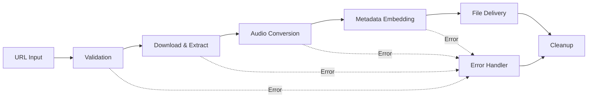
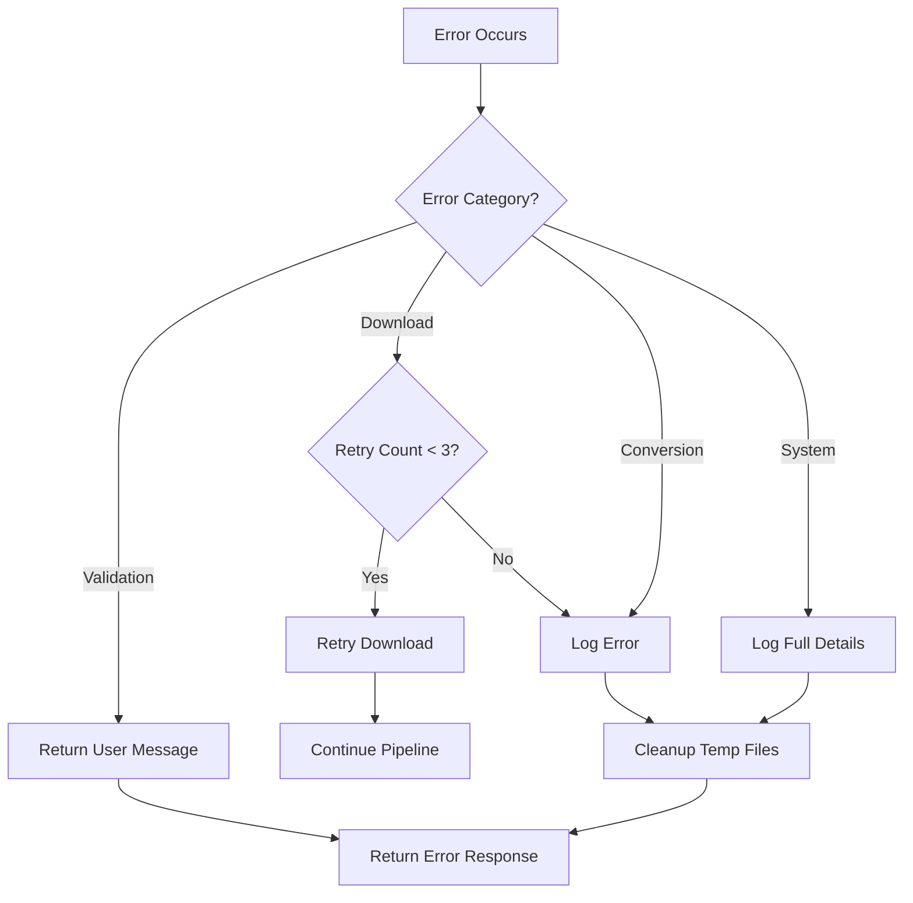
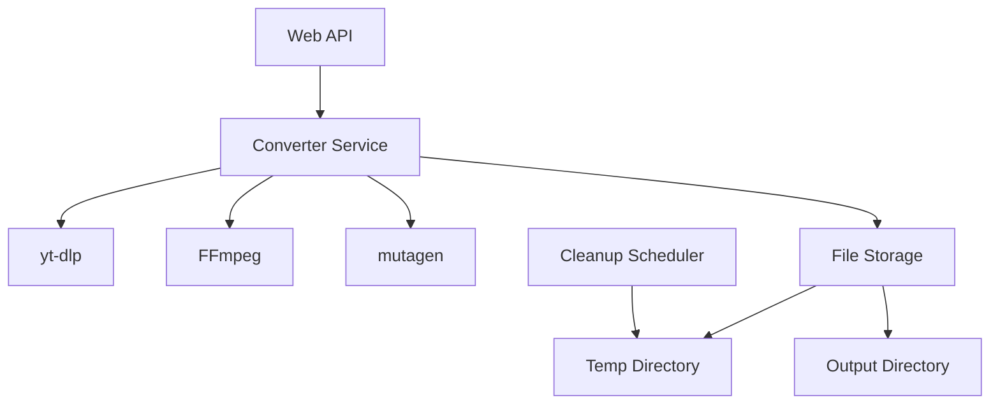
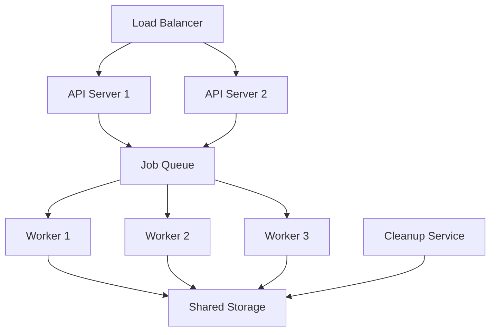

# Design Document: YouTube to MP3 Converter

## Overview

The YouTube to MP3 Converter is a Python-based system that downloads YouTube videos and converts them to MP3 audio files with embedded metadata. The system uses [yt-dlp](https://github.com/yt-dlp/yt-dlp) for video downloading and audio extraction, [FFmpeg](https://ffmpeg.org/) for audio encoding, and [mutagen](https://mutagen.readthedocs.io/) for metadata embedding.

### Key Design Principles

1. **Separation of Concerns**: URL validation, download, conversion, and metadata handling are isolated components
2. **Progress Transparency**: Real-time progress reporting throughout the conversion pipeline
3. **Robust Error Handling**: Graceful degradation with clear error messages at each stage
4. **Resource Management**: Automatic cleanup of temporary files with storage limits

### Technology Stack

- **Python 3.8+**: Core language
- **yt-dlp**: YouTube video downloading and audio stream extraction
- **FFmpeg**: Audio encoding to MP3 format (128-320 kbps)
- **mutagen**: ID3 tag embedding for MP3 metadata
- **asyncio**: Asynchronous operations for progress tracking

## Architecture

The system follows a pipeline architecture with five main stages:



### Pipeline Stages

1. **Validation Stage**: Verifies YouTube URL format and video accessibility
2. **Download Stage**: Downloads video content and extracts audio stream using yt-dlp
3. **Conversion Stage**: Encodes audio to MP3 format using FFmpeg
4. **Metadata Stage**: Embeds video information into MP3 ID3 tags using mutagen
5. **Delivery Stage**: Provides the final MP3 file to the user
6. **Cleanup Stage**: Removes temporary files and manages storage

### Error Handling Flow

Each stage can fail independently. Errors propagate to a centralized error handler that:
- Logs detailed error information
- Returns user-friendly error messages
- Triggers cleanup of partial files
- Reports failure status with progress set to error state

## Components and Interfaces

### 1. URLValidator Component

**Responsibility**: Validates YouTube URLs and checks video accessibility

**Interface**:
```python
class URLValidator:
    def validate_format(self, url: str) -> ValidationResult
    def check_video_exists(self, url: str) -> VideoAccessibility
    def get_video_info(self, url: str) -> VideoMetadata
```

**Implementation Details**:
- Uses regex patterns to validate YouTube URL formats (watch, shorts, embed URLs)
- Leverages yt-dlp's extract_info with `download=False` to check video accessibility
- Distinguishes between non-existent, private, age-restricted, and available videos
- Returns validation results within 2 seconds (timeout enforced)

**Error Cases**:
- Invalid URL format → `InvalidURLFormatError`
- Video not found → `VideoNotFoundError`
- Private/restricted video → `VideoAccessRestrictedError`
- Network timeout → `ValidationTimeoutError`

### 2. VideoDownloader Component

**Responsibility**: Downloads YouTube video and extracts audio stream

**Interface**:
```python
class VideoDownloader:
    def download_audio(self, url: str, output_path: str) -> DownloadResult
    def get_progress(self) -> DownloadProgress
    def cancel_download(self) -> None
```

**Implementation Details**:
- Uses yt-dlp with audio-only format selection (`bestaudio/best`)
- Implements retry logic (up to 3 attempts) for network failures
- Warns users for videos exceeding 2 hours duration
- Reports download progress via callback hooks
- Downloads to temporary directory with unique identifiers

**yt-dlp Configuration**:
```python
ydl_opts = {
    'format': 'bestaudio/best',
    'outtmpl': '%(id)s.%(ext)s',
    'progress_hooks': [progress_callback],
    'retries': 3,
    'fragment_retries': 3,
}
```

**Error Cases**:
- Network failure after retries → `DownloadFailedError`
- Unsupported video format → `UnsupportedFormatError`
- Insufficient disk space → `InsufficientStorageError`

### 3. AudioConverter Component

**Responsibility**: Converts audio to MP3 format with specified bitrate

**Interface**:
```python
class AudioConverter:
    def convert_to_mp3(self, input_path: str, output_path: str, bitrate: int) -> ConversionResult
    def get_progress(self) -> ConversionProgress
    def estimate_completion_time(self) -> timedelta
```

**Implementation Details**:
- Uses FFmpeg via subprocess for audio encoding
- Supports bitrate range: 128-320 kbps (default: 192 kbps)
- Preserves original audio quality within MP3 constraints
- Monitors FFmpeg output for progress reporting
- Enforces 5-minute timeout for videos up to 1 hour

**FFmpeg Command**:
```bash
ffmpeg -i input.webm -vn -ar 44100 -ac 2 -b:a 192k -f mp3 output.mp3
```

**Progress Calculation**:
- Parses FFmpeg output for time position
- Calculates percentage: `(current_time / total_duration) * 100`
- Updates progress at least once per second

**Error Cases**:
- FFmpeg not installed → `FFmpegNotFoundError`
- Encoding timeout → `ConversionTimeoutError`
- Corrupted audio stream → `AudioCorruptedError`

### 4. MetadataEmbedder Component

**Responsibility**: Embeds video metadata into MP3 ID3 tags

**Interface**:
```python
class MetadataEmbedder:
    def embed_metadata(self, mp3_path: str, metadata: VideoMetadata) -> None
    def download_thumbnail(self, thumbnail_url: str) -> bytes
    def embed_artwork(self, mp3_path: str, image_data: bytes) -> None
```

**Implementation Details**:
- Uses mutagen library for ID3v2.4 tag manipulation
- Embeds title (TIT2), artist/channel (TPE1), and album artwork (APIC)
- Downloads thumbnail image and embeds as JPEG
- Gracefully handles missing metadata fields
- Sanitizes metadata strings for ID3 compatibility

**ID3 Tag Mapping**:
- Video title → TIT2 (Title)
- Channel name → TPE1 (Artist)
- Video thumbnail → APIC (Attached Picture, JPEG format)
- Video duration → TLEN (Length in milliseconds)

**Error Cases**:
- Thumbnail download failure → Skip artwork, continue with other metadata
- Invalid metadata characters → Sanitize and embed
- MP3 file locked → `FileAccessError`

### 5. ProgressTracker Component

**Responsibility**: Aggregates and reports progress across all stages

**Interface**:
```python
class ProgressTracker:
    def update_stage(self, stage: Stage, progress: float) -> None
    def get_overall_progress(self) -> float
    def get_current_stage(self) -> Stage
    def subscribe(self, callback: Callable[[ProgressUpdate], None]) -> None
```

**Implementation Details**:
- Tracks progress for each pipeline stage independently
- Calculates weighted overall progress:
  - Validation: 5%
  - Download: 50%
  - Conversion: 35%
  - Metadata: 5%
  - Delivery: 5%
- Updates subscribers at least once per second
- Thread-safe progress updates using locks

**Progress Update Format**:
```python
@dataclass
class ProgressUpdate:
    stage: Stage
    stage_progress: float  # 0.0 to 1.0
    overall_progress: float  # 0.0 to 1.0
    estimated_time_remaining: Optional[timedelta]
    message: str
```

### 6. FileManager Component

**Responsibility**: Manages temporary files and storage cleanup

**Interface**:
```python
class FileManager:
    def create_temp_file(self, prefix: str) -> Path
    def cleanup_file(self, path: Path, delay_seconds: int = 60) -> None
    def get_storage_usage(self) -> int
    def cleanup_old_files(self) -> None
    def sanitize_filename(self, name: str) -> str
```

**Implementation Details**:
- Creates temporary files in dedicated directory with unique IDs
- Schedules cleanup tasks using asyncio delayed execution
- Monitors storage usage and enforces 5 GB limit
- Removes oldest files first when approaching 4 GB threshold
- Sanitizes filenames by removing invalid characters: `< > : " / \ | ? *`

**Cleanup Strategy**:
- Successful conversion: Delete temp files after 60 seconds
- Failed conversion: Delete partial files after 60 seconds
- Storage limit: Delete oldest files when usage > 4 GB
- Startup: Clean files older than 24 hours

### 7. ErrorHandler Component

**Responsibility**: Centralizes error handling and user messaging

**Interface**:
```python
class ErrorHandler:
    def handle_error(self, error: Exception, context: ErrorContext) -> ErrorResponse
    def log_error(self, error: Exception, context: ErrorContext) -> None
    def get_user_message(self, error: Exception) -> str
```

**Implementation Details**:
- Maps internal exceptions to user-friendly messages
- Logs detailed error information for debugging
- Provides actionable guidance when possible
- Sanitizes error messages to avoid exposing sensitive information

**Error Message Examples**:
- `VideoNotFoundError` → "The video could not be found. Please check the URL and try again."
- `VideoAccessRestrictedError` → "This video is private or restricted. Authentication may be required."
- `UnsupportedFormatError` → "This video format is not supported. Supported formats: MP4, WebM, M4A."
- `ConversionTimeoutError` → "Conversion took too long. Please try a shorter video."

## Data Models

### VideoMetadata

```python
@dataclass
class VideoMetadata:
    video_id: str
    title: str
    channel: str
    duration: int  # seconds
    thumbnail_url: str
    upload_date: Optional[str]
    description: Optional[str]
```

### ValidationResult

```python
@dataclass
class ValidationResult:
    is_valid: bool
    video_metadata: Optional[VideoMetadata]
    error_message: Optional[str]
    validation_time: float  # seconds
```

### DownloadResult

```python
@dataclass
class DownloadResult:
    success: bool
    audio_file_path: Optional[Path]
    format: str  # e.g., "webm", "m4a"
    file_size: int  # bytes
    download_time: float  # seconds
```

### ConversionResult

```python
@dataclass
class ConversionResult:
    success: bool
    mp3_file_path: Optional[Path]
    bitrate: int  # kbps
    file_size: int  # bytes
    conversion_time: float  # seconds
```

### MP3File

```python
@dataclass
class MP3File:
    file_path: Path
    file_size: int  # bytes
    file_size_mb: float
    filename: str
    bitrate: int  # kbps
    duration: int  # seconds
    metadata: VideoMetadata
```

## Correctness Properties

*A property is a characteristic or behavior that should hold true across all valid executions of a system—essentially, a formal statement about what the system should do. Properties serve as the bridge between human-readable specifications and machine-verifiable correctness guarantees.*

Before defining properties, I need to analyze which acceptance criteria are suitable for property-based testing.


### Property 1: URL Format Validation

*For any* string input, the URL validator SHALL correctly identify whether it matches valid YouTube URL patterns and reject invalid formats with an error message returned within 2 seconds.

**Validates: Requirements 1.1, 1.4**

### Property 2: Duration Warning Logic

*For any* video metadata with a duration value, the system SHALL issue a warning message if and only if the duration exceeds 2 hours (7200 seconds).

**Validates: Requirements 2.3**

### Property 3: Retry Logic on Network Failure

*For any* download operation that encounters network failures, the system SHALL attempt exactly 3 retries before returning an error, regardless of the failure type.

**Validates: Requirements 2.4**

### Property 4: Bitrate Range Enforcement

*For any* bitrate value provided for MP3 encoding, the system SHALL enforce that the final encoded bitrate falls within the range of 128 kbps to 320 kbps, clamping values outside this range.

**Validates: Requirements 3.2**

### Property 5: Metadata Embedding Completeness

*For any* video metadata and MP3 file, the system SHALL embed all available metadata fields (title as TIT2, channel as TPE1, thumbnail as APIC) into the MP3 ID3 tags, and SHALL successfully create the MP3 file even when some metadata fields are missing.

**Validates: Requirements 4.1, 4.2, 4.3, 4.4**

### Property 6: Progress Tracking Monotonicity

*For any* conversion process, the reported progress percentage SHALL be monotonically non-decreasing throughout all stages (download, encoding, delivery) and SHALL reach exactly 100% upon successful completion.

**Validates: Requirements 5.1, 5.2, 5.4**

### Property 7: Filename Sanitization

*For any* video title string, the filename sanitization function SHALL remove all invalid filename characters (< > : " / \ | ? *) while preserving all valid characters, producing a valid filename for the target filesystem.

**Validates: Requirements 6.2**

### Property 8: File Size Calculation Accuracy

*For any* file with a size in bytes, the conversion to megabytes SHALL be accurate within 0.01 MB, using the formula: size_mb = size_bytes / (1024 * 1024).

**Validates: Requirements 6.3**

### Property 9: Error Message Descriptiveness

*For any* error that occurs during conversion (validation, download, encoding, metadata embedding), the system SHALL return a descriptive error message that identifies the stage and nature of the failure, and SHALL log detailed error information for unexpected errors while returning a generic message to users.

**Validates: Requirements 7.1, 7.3, 7.4**

### Property 10: Storage Limit Enforcement

*For any* sequence of file operations, the system SHALL maintain total temporary storage usage at or below 5 GB by refusing new operations or triggering cleanup when the limit would be exceeded.

**Validates: Requirements 8.3**

### Property 11: Cleanup Prioritization by Age

*For any* set of temporary files when storage exceeds 4 GB, the cleanup process SHALL delete files in order of creation timestamp (oldest first) until storage falls below the threshold.

**Validates: Requirements 8.4**

## Error Handling

### Error Categories

The system defines four error categories with distinct handling strategies:

1. **Validation Errors**: Occur during URL validation
   - Fast-fail with immediate user feedback
   - No cleanup required (no resources allocated)
   - Examples: Invalid URL format, video not found, access restricted

2. **Download Errors**: Occur during video download
   - Retry logic applied (up to 3 attempts)
   - Cleanup of partial downloads required
   - Examples: Network timeout, connection refused, insufficient storage

3. **Conversion Errors**: Occur during audio encoding
   - No retry (conversion is deterministic)
   - Cleanup of temporary audio files required
   - Examples: FFmpeg failure, corrupted audio, encoding timeout

4. **System Errors**: Unexpected errors
   - Logged with full stack trace
   - Generic message to user
   - Cleanup of all temporary resources
   - Examples: Disk full, permission denied, out of memory

### Error Recovery Strategy



### Error Response Format

All errors return a standardized response:

```python
@dataclass
class ErrorResponse:
    success: bool = False
    error_code: str
    error_message: str  # User-friendly message
    stage: Stage  # Where error occurred
    timestamp: datetime
    retry_possible: bool
```

### Timeout Handling

The system enforces timeouts at multiple stages:

- **URL Validation**: 2 seconds
- **Video Download**: 10 minutes (adjustable based on video length)
- **Audio Conversion**: 5 minutes for videos up to 1 hour
- **Metadata Embedding**: 30 seconds
- **Cleanup Operations**: 60 seconds

Timeouts trigger cancellation of the current operation and initiate cleanup procedures.

## Testing Strategy

### Dual Testing Approach

The system requires both property-based tests and example-based unit tests for comprehensive coverage:

**Property-Based Tests** (for universal properties):
- Test universal behaviors across many generated inputs
- Minimum 100 iterations per property test
- Focus on validation logic, data transformations, and error handling
- Each test references its design document property

**Unit Tests** (for specific scenarios):
- Test specific examples and edge cases
- Test integration points with external libraries (yt-dlp, FFmpeg, mutagen)
- Test timing and performance requirements
- Test external service interactions (YouTube API)

### Property-Based Testing Configuration

**Testing Library**: Use [Hypothesis](https://hypothesis.readthedocs.io/) for Python property-based testing

**Test Requirements**:
- Each correctness property SHALL have exactly one property-based test
- Each test SHALL run minimum 100 iterations
- Each test SHALL include a comment tag: `# Feature: youtube-to-mp3-converter, Property {number}: {property_text}`
- Tests SHALL use appropriate Hypothesis strategies for input generation

**Example Property Test Structure**:

```python
from hypothesis import given, strategies as st

# Feature: youtube-to-mp3-converter, Property 7: Filename Sanitization
@given(st.text())
def test_filename_sanitization_removes_invalid_chars(title):
    """For any video title string, sanitization removes invalid filename characters."""
    sanitized = FileManager.sanitize_filename(title)
    invalid_chars = set('<>:"/\\|?*')
    assert not any(char in sanitized for char in invalid_chars)
```

### Unit Test Coverage

**Validation Tests**:
- Valid YouTube URL formats (watch, shorts, embed, mobile)
- Invalid URL formats
- Non-existent video handling
- Private/restricted video handling
- Validation timeout enforcement

**Download Tests**:
- Successful download with progress tracking
- Network failure and retry logic
- Duration warning for long videos
- Unsupported format handling

**Conversion Tests**:
- MP3 encoding with various bitrates
- Conversion timeout enforcement
- Audio quality preservation (manual verification)
- FFmpeg error handling

**Metadata Tests**:
- Complete metadata embedding
- Partial metadata handling (missing fields)
- Thumbnail download and embedding
- ID3 tag format validation

**Progress Tests**:
- Progress updates across all stages
- Update frequency (at least once per second)
- Completion detection (100% progress)
- Progress during error scenarios

**File Management Tests**:
- Filename sanitization with various invalid characters
- File size calculation accuracy
- Temporary file creation and cleanup
- Storage limit enforcement
- Oldest-first cleanup strategy

**Error Handling Tests**:
- Error messages for each error category
- Error logging for unexpected errors
- Cleanup on error scenarios
- Timeout handling

### Integration Tests

Integration tests verify end-to-end functionality with real external services:

1. **Complete Conversion Flow**: Valid URL → MP3 file with metadata
2. **Error Scenarios**: Invalid URL, non-existent video, network failure
3. **Performance**: Conversion time for various video lengths
4. **Resource Cleanup**: Temporary file deletion after success/failure

### Test Data

**Mock Video Metadata**:
```python
@dataclass
class MockVideoMetadata:
    video_id: str = "dQw4w9WgXcQ"
    title: str = "Test Video Title"
    channel: str = "Test Channel"
    duration: int = 212  # seconds
    thumbnail_url: str = "https://example.com/thumb.jpg"
```

**Test YouTube URLs**:
- Valid: `https://www.youtube.com/watch?v=VIDEO_ID`
- Valid short: `https://youtu.be/VIDEO_ID`
- Valid embed: `https://www.youtube.com/embed/VIDEO_ID`
- Invalid: `https://example.com/video`, `not-a-url`, `https://youtube.com/invalid`

## Implementation Notes

### Dependencies

```
yt-dlp>=2024.1.0
mutagen>=1.47.0
hypothesis>=6.90.0  # For property-based testing
```

**System Requirements**:
- Python 3.8+
- FFmpeg installed and available in PATH
- Minimum 5 GB free disk space for temporary storage

### Performance Considerations

1. **Concurrent Downloads**: Limit to 3 simultaneous conversions to manage resources
2. **Progress Updates**: Throttle updates to once per second to reduce overhead
3. **Thumbnail Caching**: Cache downloaded thumbnails to avoid redundant requests
4. **Lazy Cleanup**: Delay cleanup by 60 seconds to allow user download time

### Security Considerations

1. **URL Validation**: Prevent SSRF attacks by validating YouTube domain
2. **Filename Sanitization**: Prevent directory traversal with path validation
3. **Resource Limits**: Enforce storage limits to prevent disk exhaustion
4. **Error Messages**: Sanitize error messages to avoid information disclosure

### Scalability Considerations

For high-volume deployments:
- Implement job queue (e.g., Celery) for asynchronous processing
- Use distributed storage for temporary files
- Add rate limiting to prevent YouTube API throttling
- Implement caching layer for frequently converted videos

## Deployment Architecture

### Single-Server Deployment



### Multi-Server Deployment



## Monitoring and Observability

### Key Metrics

1. **Conversion Metrics**:
   - Conversion success rate
   - Average conversion time by video duration
   - Bitrate distribution
   - File size distribution

2. **Error Metrics**:
   - Error rate by category (validation, download, conversion, system)
   - Retry success rate
   - Timeout frequency

3. **Resource Metrics**:
   - Temporary storage usage
   - Cleanup frequency
   - Concurrent conversion count
   - Memory usage per conversion

4. **Performance Metrics**:
   - API response time
   - Download speed
   - Encoding speed
   - End-to-end conversion time

### Logging Strategy

**Log Levels**:
- **DEBUG**: Detailed progress information, FFmpeg output
- **INFO**: Conversion start/complete, stage transitions
- **WARNING**: Duration warnings, retry attempts, approaching storage limits
- **ERROR**: Conversion failures, timeout errors, cleanup failures
- **CRITICAL**: System errors, storage exhausted, FFmpeg not found

**Log Format**:
```
[timestamp] [level] [conversion_id] [stage] message
```

**Example Logs**:
```
2024-01-15 10:30:45 INFO conv_abc123 validation URL validated successfully: dQw4w9WgXcQ
2024-01-15 10:30:46 INFO conv_abc123 download Starting download for video: Test Video
2024-01-15 10:31:15 INFO conv_abc123 download Download complete: 5.2 MB
2024-01-15 10:31:16 INFO conv_abc123 conversion Starting MP3 encoding at 192 kbps
2024-01-15 10:31:45 INFO conv_abc123 conversion Encoding complete: 3.8 MB
2024-01-15 10:31:46 INFO conv_abc123 metadata Metadata embedded successfully
2024-01-15 10:31:46 INFO conv_abc123 delivery MP3 file ready: test_video.mp3
2024-01-15 10:32:46 INFO conv_abc123 cleanup Temporary files deleted
```

## Future Enhancements

1. **Playlist Support**: Convert entire YouTube playlists to MP3
2. **Quality Selection**: Allow users to choose audio quality/bitrate
3. **Format Options**: Support additional output formats (AAC, FLAC, OGG)
4. **Batch Processing**: Convert multiple URLs in a single request
5. **Resume Capability**: Resume interrupted downloads
6. **Cloud Storage**: Direct upload to S3, Google Drive, Dropbox
7. **Webhook Notifications**: Notify users when conversion completes
8. **API Rate Limiting**: Implement per-user rate limits
9. **Authentication**: Add user accounts and conversion history
10. **Advanced Metadata**: Support custom metadata editing before conversion
